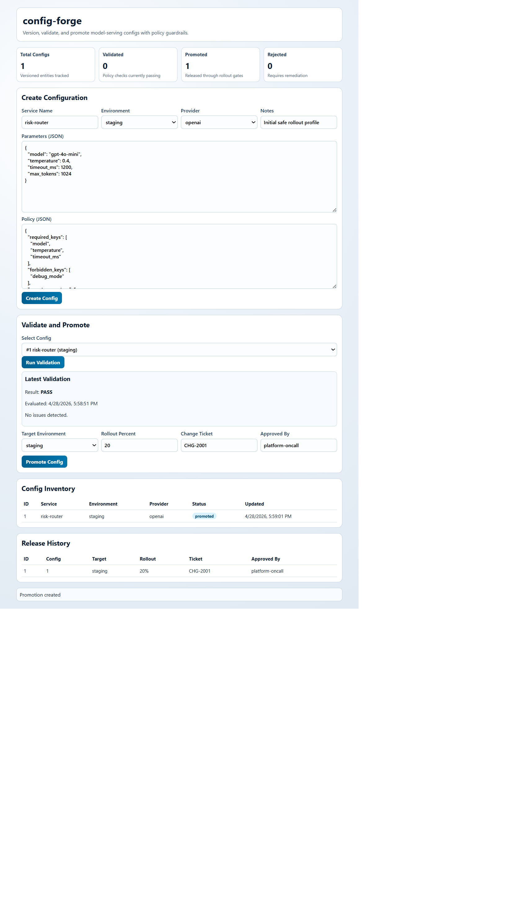

# config-forge

Production-grade configuration governance platform for LLM and model-serving stacks.

## What It Does

1. Stores versioned service configurations with environment context.
2. Validates payloads against policy gates before rollout.
3. Tracks validation outcomes and operational issues.
4. Promotes validated configurations into staged or production rollouts.
5. Exposes API + dashboard views for release and audit visibility.

## Stack

- Backend: FastAPI + SQLite
- Frontend: React + Vite + TypeScript
- Deployment: Docker, Docker Compose, GitHub Actions, GHCR, GitHub Pages

## Dashboard Screenshot



## Quick Start

```bash
cp .env.example .env
cd backend
python -m venv .venv
.\.venv\Scripts\Activate.ps1
pip install -r requirements.txt
pytest -q

cd ../frontend
npm install
npm run build
```

Run full stack:

```bash
docker compose --env-file .env -f docker-compose.yml up --build
```

## API and Ops Docs

- docs/API.md
- docs/DEPLOYMENT.md
- docs/OPERATIONS.md
- docs/FUTURE-CLARIFICATIONS.md

## Current Status

- v0.1.0 baseline: deploy-ready foundation
- Next: policy templates, peer approvals, and signed change manifests
